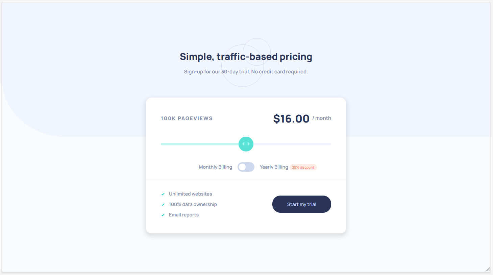
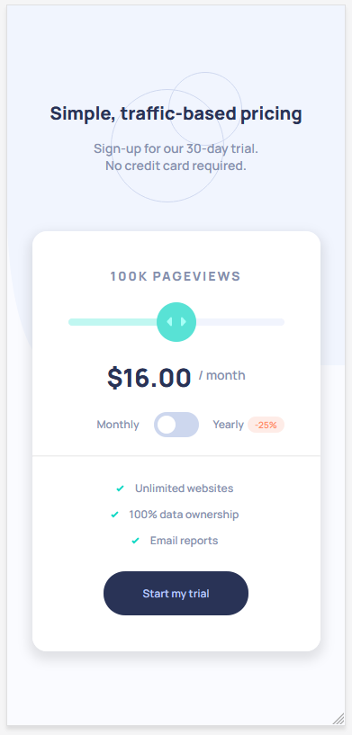

# Front End Mentor Challenge 2

## About  
Implementation of challenge from Front End Mentor.   
[Interactive pricing component](https://www.frontendmentor.io/challenges/interactive-pricing-component-t0m8PIyY8)

-Desktop & Mobile Layouts  
-Responsive  
-Displays subscription prices monthly and yearly for different service levels   
-Created with React  
-Uses Redux, Typescript, SASS, Jest, React Testing Library  

## How to run

1 - Clone repo  
2 - 'npm install'  
3 - 'npm start'  

## Screenshots

